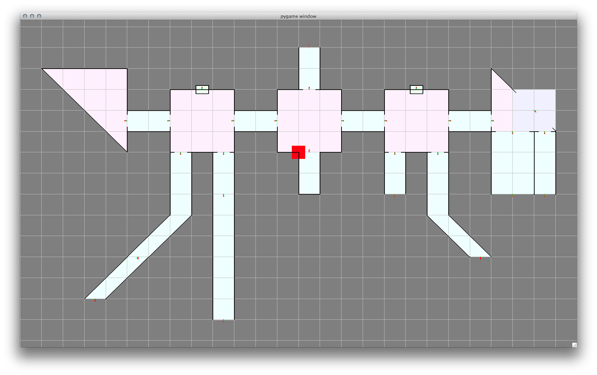

aagen
=====

Installation
------------

This program requires Python 2.7 and the pygame and shapely libraries.

On a Mac using MacPorts you can install these as follows:

    sudo port install python27
    sudo port install py27-game
    sudo port install py27-shapely

Once you have these installed you can launch the program with `./main.py`

Use
---

If you run the program with no parameters, it will generate a new random
dungeon. On the console you will see various informational and debug messages.
One of the first messages output to the console will report the "seed" that was
used to generate this dungeon:

    INFO:Dungeon_Generator:Random seed is 1201576528

If you want to recreate the same dungeon again, you can launch the program with
`./main.py -s <seed number>` and the exact same dungeon will be generated as
before (barring any changes to the dungeon generation algorithms, of course!).

**This is key when reporting bugs - please provide the seed number under which
the bug was encountered so as to make it very easy to recreate the issue!**

Press `SPACE` to iterate another step of the dungeon generator, constructing a
new room or passage and adding it to the map. If the map dead-ends completely
with no possibilities for adding new regions, pressing `SPACE` will cause a new
map to be created. Press `ESC` twice to quit the program.

If an error occurs, the error will be reported on your console and the program
will "freeze", continuing to display the current state of the map but refusing
to generate any more map content. This is intentional, allowing you to take
screenshots and capture console logs for debugging. Once you've gathered
whatever information you need, press `ESC` once to quit the program.

